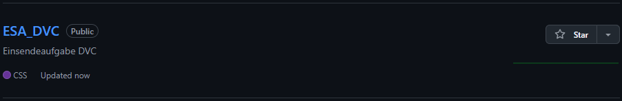
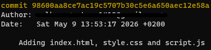
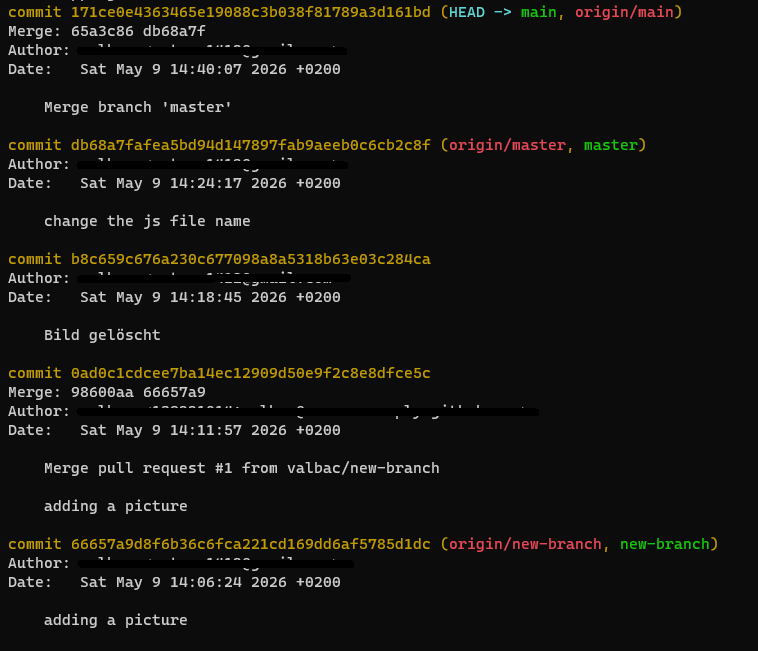

# ESA_DVC

## 1. Repository erstellen

## 2. Eigenes Projekt hochladen 

## 3. Git-Methoden anwenden & 4. Mit Zeitreisen experimentieren & 5. Branches erstellen und mergen

## 6. Pull-Request erstellen
https://github.com/edlich/education/pull/604
